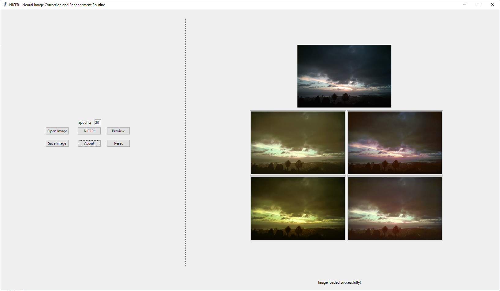

# AutoNICER

本アプリケーションは[Michael Fischerらの研究における実装](https://github.com/mr-Mojo/NICER)を応用したものである．  
NICERとは **Neural Image Correction and Enhancement Routine** の略である．  
端的に言うと入力画像を「映える」画像に改善するアプリケーションである．  
技術の詳細については[彼らの論文](https://www.thinkmind.org/index.php?view=article&articleid=achi_2020_5_390_20186)を参照．

## 本アプリケーションの特徴

- 非専門家にとって分かりやすいUI
- 画像自体をクリックして選択できる
- 選択した画像を元にさらなる画像改善を行う

## セットアップ

1. 必要なライブラリを `requirement.txt` を元にインストール
1. `python main.py` を実行するとGUIが起動する

## 使い方
GUIが開くと左側にボタン類が並んでいる
1. `Open Image` をクリックして画像を選択する
1. `Epochs` の値を任意の値に変更する (基本的にそのままでOK)
1. `NICER!` をクリックしてしばらく待機する
1. 画像処理が完了すると以下のような画面になる  
    
1. 処理後の4枚から自分が気に入った画像をクリックする (画像そのものをクリック)
1. 元画像の部分が選択した画像に置き換わり，処理後の4枚の画像がリセットされる
    1. ここでやめたかったら，`Save Image` を選択して画像を保存する  
    保存される画像は「原画像があった位置」にある画像
    1. 続けたかったら，`NICER!` をクリックする
1. 気が済むまで繰り返す

## 参考文献

[NICER](https://github.com/mr-Mojo/NICER)  
Michael Fischer, Konstantin Kobs, and Andreas Hotho. NICER: Aesthetic Image Enhancement with Humans in the Loop. Proceedings of The Thirteenth International Conference on Advances in Computer-Human Interactions, 2020.

NIMA - PyTorchビルトイン  
Hossein Talebi and Peyman Milanfar. NIMA: Neural Image Assessment. IEEE Transactions on Image Processing, Vol. 27, No. 8, pp. 3998–4011, 2018.

[ReLIC](https://github.com/fei-aiart/ReLIC)  
Lin Zhao, Meimei Shang, Fei Gao, Rongsheng Li, Fei Huang, and Jun Yu. Representation learning of image composition for aesthetic prediction. Computer Vision and Image Understanding, 2020.